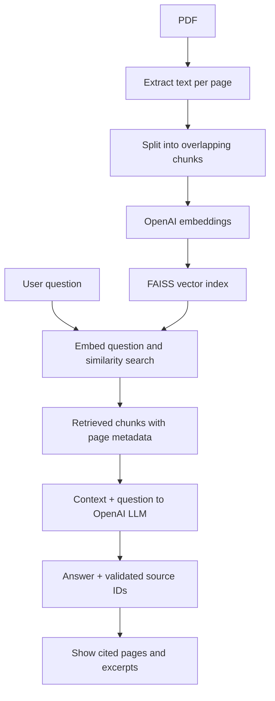

# Simple RAG

**Ask Your PDF** — a minimal Retrieval-Augmented Generation application showing how document ingestion, embeddings, retrieval, and LLM generation work together.

**Author:** Amal Chaitanya

Start with one concept: PDF → chunks → embeddings → vector search → LLM → answer + sources.

## What you can do

- Upload one text-based PDF or use the included fictional policy PDF.
- Build an in-memory FAISS vector index with OpenAI embeddings.
- Ask a question and see an answer with physical PDF page numbers.
- Expand the cited passages and inspect every retrieved chunk.
- Adjust the number of retrieved chunks to explore retrieval behavior.

## Architecture



Indexing runs once per PDF per browser session. Asking another question reuses the index. FAISS is a local vector search library; this demo does not run a separate database service.

## Run locally

Requires **Python 3.11 or 3.12** and an OpenAI API key with access to the configured models. API calls require network access and may incur charges.

```bash
git clone https://github.com/chaitanya9494/simple-rag.git
cd simple-rag
python -m venv .venv
```

Activate the environment:

```powershell
# Windows PowerShell
.\.venv\Scripts\Activate.ps1
Copy-Item .env.example .env
```

```bash
# macOS / Linux
source .venv/bin/activate
cp .env.example .env
```

Install dependencies, edit `.env` to set `OPENAI_API_KEY`, and start:

```bash
python -m pip install -r requirements.txt
python -m streamlit run app.py
```

Open the local URL printed by Streamlit, usually http://localhost:8501. If PowerShell activation is blocked, use `.\.venv\Scripts\python.exe` directly in place of `python`.

The defaults are `gpt-4o-mini` for generation and `text-embedding-3-small` for embeddings. Override them in `.env` if needed. Never commit your real API key. Restart Streamlit after changing `.env`.

## Try these questions

Select **Use the sample policy PDF**, click **Build PDF index**, and ask:

| Question | Expected evidence |
| --- | --- |
| What is the refund policy? | Page 3: first purchase, within 30 days; renewals excluded |
| How do I cancel my subscription? | Page 2: Settings > Billing; access lasts through the paid term |
| When is support available? | Page 4: Monday–Friday, 9 AM–5 PM Central Time |
| What is the CEO's favorite programming language? | No supported answer in this PDF |

Answers may vary. Compare each answer with its cited excerpts. The sample company and policies are fictional and included under this project's MIT license.

## Read the code in this order

| File | Responsibility |
| --- | --- |
| `rag/loader.py` | Extract page text and attach filename + page number |
| `rag/chunker.py` | Split text; keep metadata on every chunk |
| `rag/embeddings.py` | Configure the embedding model |
| `rag/retriever.py` | Build FAISS index and retrieve similar chunks |
| `rag/generator.py` | Prompt the LLM and validate source IDs |
| `app.py` | Connect the steps to a small Streamlit UI |

The main flow is deliberately explicit:

```python
documents = load_pdf(data, filename)
chunks = split_documents(documents)
vector_store = create_vector_store(chunks, create_embeddings())
context = retrieve(question, vector_store)
answer = generate(question, context)
```

Chunks are up to 1,000 **characters**, with 200 characters of overlap. These are teaching defaults, not optimized settings. Each chunk stays within its original PDF page so its citation stays easy to understand.

## What citations do and do not prove

The model returns an answer and supporting chunk IDs in a structured response. The app checks that every cited ID exists in the retrieved context and displays the corresponding page and excerpt. If IDs are missing or invalid, it withholds the answer.

This checks citation membership, **not factual correctness or entailment**. A valid ID can still point to a passage that does not support a claim. Inspect the sources. Similarity search always returns its nearest available chunks; there is no calibrated relevance threshold in this first version. The prompt asks the model to abstain when evidence is insufficient, but that behavior is not guaranteed.

## Data and scope

- Extracted PDF text is sent to OpenAI for embedding; your question is also embedded. Retrieved excerpts and the question are sent for generation.
- PDFs and vectors remain in server memory for the current browser session. The app does not save uploaded files or indexes to disk and does not globally cache documents.
- **Clear session** releases references to the active index and answers. This is not a secure memory-erasure guarantee.
- One PDF at a time, at most 10 MB and 500 chunks. These are demo limits, not hardened resource isolation.
- Text-based PDFs only. Scanned documents need OCR; encrypted documents are rejected. Page numbers refer to PDF position, which can differ from printed page labels.
- PDF content is treated as untrusted context in the prompt. Prompt instructions alone do not eliminate prompt injection.
- Local teaching app: no authentication, multi-user isolation guarantee, persistence, conversational memory, reranking, or production deployment setup.

## Tests

```bash
python -m pip install -r requirements-dev.txt
python -m pytest -q
```

Tests exercise real PDF extraction, metadata-preserving chunking, FAISS retrieval using deterministic test embeddings, valid/invalid citations, and Streamlit indexing/question/session flows with stubbed API calls. They do not contact OpenAI or evaluate real model quality. GitHub Actions runs them on Python 3.12.

Regenerate the sample PDF with `python scripts/create_sample_pdf.py`.

## Video and future lessons

See [the six-minute recording outline](docs/video-outline.md) for three slide briefs, narration, demo questions, and the code walkthrough. Add the video link here after publishing.

Possible follow-ups: embeddings, chunk-size experiments, evaluation, reranking, metadata filters, multiple PDFs, and hybrid search. Keep the first lesson small.

## References

This is an original teaching implementation, not a fork. Useful official references:

- [LangChain retrieval concepts](https://docs.langchain.com/oss/python/langchain/retrieval)
- [LangChain OpenAI embeddings](https://docs.langchain.com/oss/python/integrations/embeddings/openai)
- [LangChain ChatOpenAI](https://docs.langchain.com/oss/python/integrations/chat/openai)
- [Streamlit file uploads](https://docs.streamlit.io/develop/api-reference/widgets/st.file_uploader)

## Contributing and license

Small, understandable improvements are welcome. Describe the behavior you're changing, run the tests, and avoid committing PDFs containing private data or credentials. Licensed under [MIT](LICENSE).
